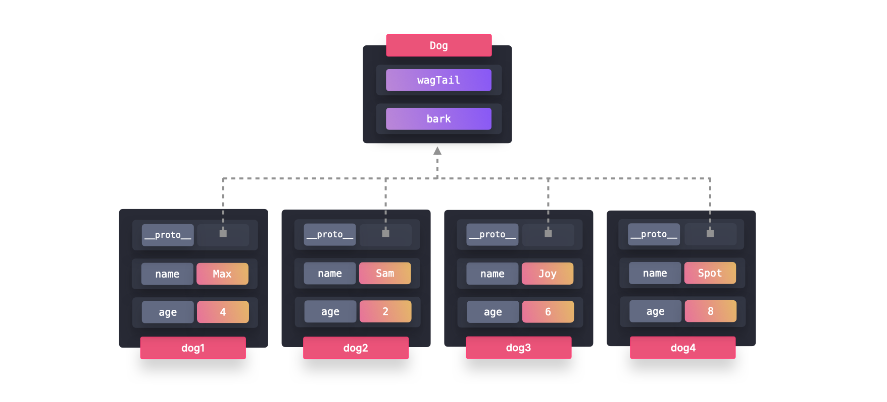
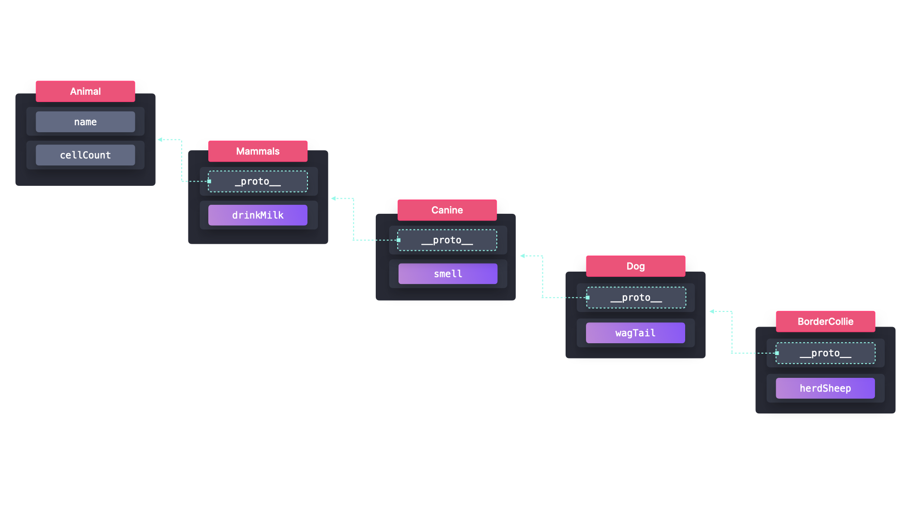

# Patrón Prototype en JavaScript

## Introducción
Este README contiene notas sobre el **Patrón Prototype** en JavaScript. El Patrón Prototype permite que múltiples objetos del mismo tipo compartan propiedades y métodos de manera eficiente aprovechando la cadena de prototipos de JavaScript.

## Temas Cubiertos
- ¿Qué es el Patrón Prototype?
- ¿Cómo funciona?
- Implementación en JavaScript
  - Uso de una función de fábrica (menos eficiente)
  - Uso de clases ES6 (basadas en prototipos)
- Ventajas y desventajas del Patrón Prototype
- Información adicional sobre la herencia de prototipos en JavaScript

## ¿Qué es el Patrón Prototype?
El **Patrón Prototype** es un patrón de diseño que permite a los objetos compartir métodos de manera eficiente. En lugar de asignar memoria para cada función en cada instancia, los métodos se almacenan en el **prototipo** de la función constructora o clase, permitiendo que todas las instancias los accedan sin redundancia.

### ¿Por qué usar el Patrón Prototype?
- **Reduce el uso de memoria** al evitar la duplicación de métodos en cada instancia.
- **Encapsula el comportamiento compartido** en un solo lugar (el prototipo).
- **Mejora el rendimiento** al crear múltiples objetos similares.

## Implementación en JavaScript

### Enfoque Menos Eficiente: Uso de una Función de Fábrica
Una **función de fábrica** crea objetos dinámicamente, pero asigna memoria para los métodos cada vez que se crea un nuevo objeto.

```javascript
const createDog = (name, age) => ({
  name,
  age,
  bark() {
    console.log(`${name} está ladrando!`);
  },
  wagTail() {
    console.log(`${name} está moviendo la cola!`);
  },
});

const dog1 = createDog("Max", 4);
const dog2 = createDog("Sam", 2);
const dog3 = createDog("Joy", 6);
const dog4 = createDog("Spot", 8);
```


#### Problema con las Funciones de Fábrica
Cada nuevo objeto creado tiene su propia copia de los métodos `bark` y `wagTail`, lo que genera una asignación innecesaria de memoria.

---

### Enfoque Más Eficiente: Uso de Prototipos (Clases ES6)
Un **enfoque basado en prototipos** asegura que todas las instancias compartan los mismos métodos sin duplicación.

```javascript
class Dog {
  constructor(name, age) {
    this.name = name;
    this.age = age;
  }

  bark() {
    console.log(`${this.name} está ladrando!`);
  }

  wagTail() {
    console.log(`${this.name} está moviendo la cola!`);
  }
}

const dog1 = new Dog("Max", 4);
const dog2 = new Dog("Sam", 2);
const dog3 = new Dog("Joy", 6);
const dog4 = new Dog("Spot", 8);
```


#### Cadena de Prototipos
Cuando se crea una instancia usando `new Dog()`, JavaScript almacena los métodos compartidos (`bark` y `wagTail`) en el **prototipo** de la clase `Dog`.

```javascript
console.log(dog1);
// Salida: Dog { name: "Max", age: 4 }
```

Aunque la instancia no contiene explícitamente `bark` y `wagTail`, estos están disponibles a través de la **herencia de prototipos**:
```javascript
console.log(dog1.__proto__);
// Salida: Dog.prototype { bark: ƒ, wagTail: ƒ }
```

Dado que todas las instancias de `Dog` comparten el mismo prototipo, no necesitan asignaciones separadas de memoria para estos métodos.

## Ventajas y Desventajas del Patrón Prototype

### Ventajas
1. **Eficiencia en el Uso de Memoria**:  
   - Los métodos se comparten a través del prototipo, reduciendo la carga de memoria.

2. **Encapsulación del Comportamiento Compartido**:  
   - Ayuda a mantener un código limpio y basado en el principio DRY (Don't Repeat Yourself).

### Desventajas
1. **Problemas de Legibilidad**:  
   - Si una clase ha sido extendida varias veces, puede ser difícil rastrear de dónde provienen ciertas propiedades o métodos.
   - Ejemplo: Si `BorderCollie` extiende `Dog`, que a su vez extiende `Animal`, puede ser complicado determinar dónde se definieron `wagTail` o `bark` originalmente.
   

## Información Adicional: Herencia de Prototipos en JavaScript
Cada objeto en JavaScript **hereda automáticamente** del `Object.prototype`, a menos que se sobrescriba explícitamente.

- Por esto, los tipos de datos primitivos (como `String`, `Array`, `Number`) tienen métodos incorporados (`.toUpperCase()`, `.map()`, `.toFixed()`), que se heredan de sus respectivos prototipos.

```javascript
console.log("hola".toUpperCase()); // Salida: "HOLA"
console.log([1, 2, 3].map(num => num * 2)); // Salida: [2, 4, 6]
```

## Conclusión
El Patrón Prototype es una forma poderosa de optimizar el uso de memoria mientras se comparten métodos comunes entre objetos. Aprovechando la herencia de prototipos incorporada en JavaScript, los desarrolladores pueden crear aplicaciones eficientes y estructuradas sin generar una carga innecesaria de memoria. Sin embargo, los problemas de legibilidad pueden surgir en estructuras de herencia complejas, por lo que es esencial mantener un código claro y modular.

