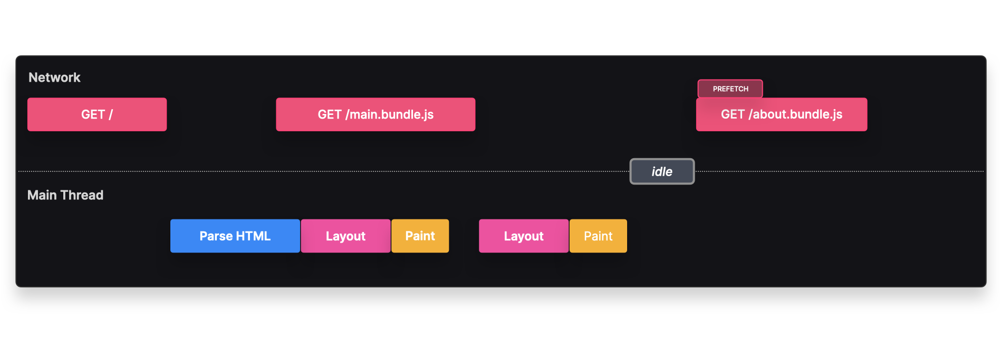
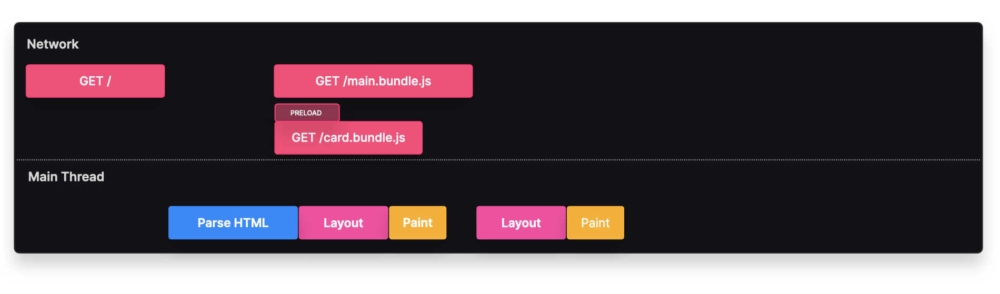

# Browser Hints

## Prefetch
### Fetch and cache resources that may be requested soon

### Overview
The **prefetch** browser hint allows fetching resources that **may** be needed in the future but **not immediately** on initial load. This is useful for subsequent page navigations that the user is **likely** to make.

A **prefetched resource** is fetched when the browser is **idle** and has enough bandwidth. The resource is then stored in cache, so when the client actually needs it, it can be retrieved **instantly** without making a request to the server.



---

> **Example:** If using **route-based splitting** and most users navigate to the `/about` route, we can prefetch this route for faster navigation and improved UX.

Instead of waiting for user interaction to fetch `about.bundle.js`, the browser **prefetches** it when idle. When the user actually navigates to `/about`, the bundle loads from cache instead of requesting it from the server.

---

### **Implementation**
We can prefetch a resource by explicitly adding it to the **head** of the HTML document:

```html
<link rel="prefetch" href="./about.bundle.js" />
```

If using **Webpack**, you can prefetch dynamically using the **`/* webpackPrefetch: true */`** magic comment:

```javascript
const About = lazy(() => import(/* webpackPrefetch: true */ "./about"));
```

### **Example with React Router**
```javascript
import React, { lazy, Suspense } from 'react';
import { createRoot } from 'react-dom/client';
import {
  Routes,
  Route,
  BrowserRouter as Router,
  Link,
  Outlet,
} from 'react-router-dom';

const App = lazy(() => import('./pages/App'));
const About = lazy(() =>
  import(/* webpackPrefetch: true, webpackChunkName: "about" */ './pages/About')
);
const Contact = lazy(() => import('./pages/Contact'));

export function Nav() {
  return (
    <div>
      <nav>
        <h1>
          <Link to="/">
            <span>🏡</span> Houses.
          </Link>
        </h1>
        <ul>
          <li><Link to="/about">About</Link></li>
          <li><Link to="/contact">Contact</Link></li>
        </ul>
      </nav>
      <Outlet />
    </div>
  );
}

createRoot(document.getElementById('root')).render(
  <Router>
    <Suspense fallback={<div>Loading...</div>}>
      <Routes>
        <Route path="/" element={<Nav />}>
          <Route path="/about" element={<About />} />
          <Route path="/contact" element={<Contact />} />
        </Route>
      </Routes>
    </Suspense>
  </Router>
);
```

### **Tradeoffs**
✅ **Faster Loading** → Prefetched resources load quickly from cache instead of making a network request.
❌ **Unnecessary Requests** → If the user never navigates to `/about`, the prefetched resource is **wasted bandwidth**.

---

## Preload
### Inform the browser of critical resources before they are discovered

### Overview
The **preload** browser hint fetches resources **critical** to the **current navigation**, such as fonts or images visible **within 3 seconds** of page load.



Unlike **prefetch**, a **preloaded resource** is always fetched, even if network conditions are poor.

> **Example:** If we want `SearchFlyout` to appear **instantly** on the landing page, we can **preload** this resource to ensure fast availability.

Instead of fetching `search-flyout.bundle.js` after the page loads, preloading **fetches it in parallel** with `main.bundle.js`. When needed, it loads instantly from the cache.

---

### **Implementation**
We can preload a resource by explicitly adding it to the **head** of the HTML document:

```html
<link rel="preload" href="./search-flyout.bundle.js" />
```

If using **Webpack**, you can preload dynamically using the **`/* webpackPreload: true */`** magic comment:

```javascript
const SearchFlyout = lazy(() => import(/* webpackPreload: true */ "./SearchFlyout"));
```

---

### **Tradeoffs**
✅ **Faster Loading** → Preloaded resources load instantly from cache instead of waiting for a network request.
✅ **Reduces Layout Shift** → Preloading fonts, styles, and images minimizes layout shifts.
❌ **Performance Cost** → Since preloaded assets are **always fetched**, unnecessary preloading **wastes bandwidth**. Instead, consider prefetching or using `async` or `defer` attributes.

```html
<link href="./script" rel="preload" />
<script rel="defer" src="./script"></script>
```

