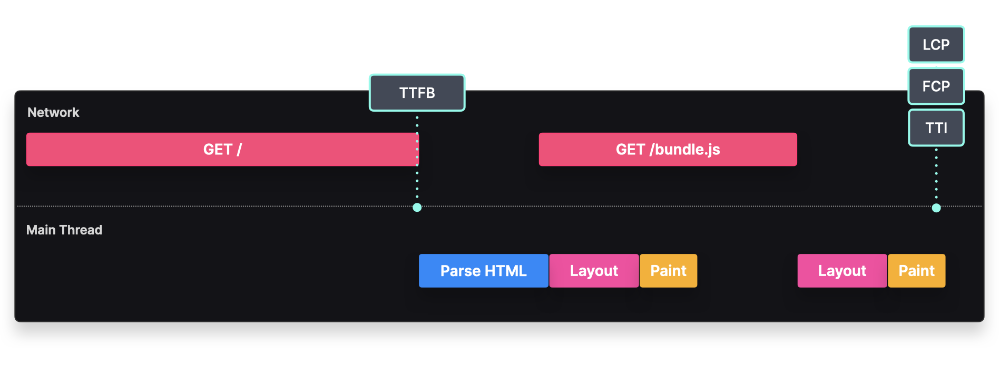

# Renderizado en el Cliente
### Renderiza la interfaz de usuario de tu aplicación en el cliente

## Descripción
El contenido de una aplicación renderizada en el cliente se genera en el navegador.

### **Paso 1**
**El cliente solicita HTML al servidor**

---

### **Paso 2**
**El servidor devuelve un HTML mínimo**  
*HTML mínimo* se refiere a una estructura HTML básica, que generalmente contiene solo los elementos esenciales como la estructura del documento (`<html>`, `<head>`, `<body>`) y marcadores de posición para el contenido dinámico. Puede incluir enlaces a hojas de estilo y archivos JavaScript, pero sin contenido completamente renderizado.

---

### **Paso 3**
**El navegador analiza y renderiza el HTML**

---

### **Paso 4**
**El cliente solicita y descarga JavaScript**

---

### **Paso 5**
**El navegador ejecuta JavaScript y renderiza el contenido**

Cuando un usuario solicita una aplicación renderizada en el cliente, el servidor inicialmente responde con el archivo HTML mínimo.

Una vez que el cliente recibe este archivo HTML, el analizador HTML procesa el contenido y obtiene el paquete de JavaScript cuando encuentra la etiqueta `script`.

Cuando el cliente ha descargado el JavaScript, lo ejecuta. Este código contiene métodos del DOM para agregar contenido dinámicamente al árbol del DOM, lo que da como resultado contenido visible en la pantalla del usuario.

---

## Implementación
Una aplicación básica renderizada en el cliente consta de al menos dos archivos.

Primero, necesitamos un archivo HTML mínimo, que contenga el elemento en el que el archivo JavaScript pueda agregar contenido dinámicamente.

```html
<html>
  <body>
    <div id="root"></div>
    <script src="/bundle.js"></script>
  </body>
</html>
```

También necesitamos un archivo JavaScript, que contenga métodos para actualizar el árbol del DOM y renderizar datos dinámicamente. Este archivo se obtiene después (o durante) el análisis del HTML.

```javascript
const root = document.getElementById("root");

// Manipulación del DOM
root.appendChild(...)
```

---

## Ventajas y Desventajas



- **TTFB (Time To First Byte)**: Puede ser rápido, ya que el HTML inicial no contiene componentes grandes.
- **FCP (First Contentful Paint)**: Ocurre una vez que el paquete de JavaScript ha sido descargado, analizado y ejecutado.
- **TTI (Time To Interactive)**: Ocurre cuando el paquete de JavaScript ha sido descargado, analizado y ejecutado para vincular los controladores de eventos a los componentes.
- **LCP (Largest Contentful Paint)**: Puede ocurrir al mismo tiempo que el First Contentful Paint, siempre que no haya componentes grandes como imágenes o videos.

### **Pros y Contras**
✅ **Interactividad**: El contenido renderizado es inmediatamente interactivo. El paquete de JavaScript obtenido puede agregar directamente Event Listeners a los nodos del DOM. A diferencia de otros patrones de renderizado, los usuarios nunca ven una página visible pero no interactiva.

✅ **Un solo viaje al servidor**: Toda la aplicación web se carga en la primera solicitud. A medida que el usuario navega haciendo clic en enlaces, no se generan nuevas solicitudes al servidor para renderizar estas páginas.

❌ **Tamaño del paquete**: Las aplicaciones modernas, que suelen contener múltiples páginas, pueden generar paquetes de JavaScript muy grandes. Cuanto más grande sea el paquete, más tiempo tardará en descargarse y ejecutarse antes de que el primer contenido sea visible e interactivo.

❌ **Limitaciones de SEO**: Paquetes grandes y una cascada de solicitudes API pueden hacer que el contenido no se renderice lo suficientemente rápido para que un rastreador lo indexe. Se requieren soluciones alternativas para hacer que un sitio web renderizado en el cliente sea compatible con SEO y evitar las limitaciones de los rastreadores para entender JavaScript.

