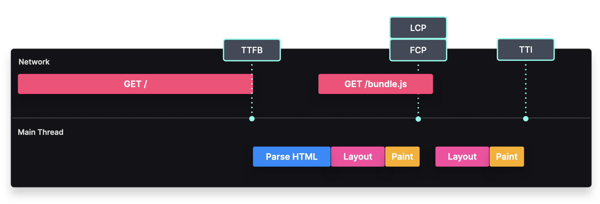
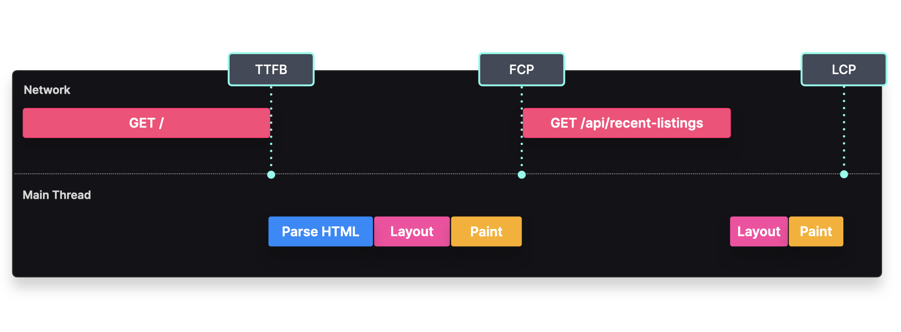

# Static Rendering
### Deliver pre-rendered HTML content that was generated when the site was built

## Overview
With static rendering, the HTML contents are pre-generated at build time.

### **Step 1**
**Client requests HTML from server**

---

### **Step 2**
**Server returns requested HTML**

---

### **Step 3**
**Browser parses and renders content**

---

### **Step 4**
**Client requests JS bundle from server**

---

### **Step 5**
**Browser hydrates elements**

When a user requests a statically rendered application, the server responds with the HTML file.

Once the client receives this HTML file, the HTML parser parses the content and renders the non-interactive content to the screen. If a script tag is present, the client sends an additional request to fetch this bundle.

When the client has downloaded the JavaScript, it executes its contents and adds event listeners to the HTML elements to make them interactive.

---

## Implementation
The bare minimum required for a static rendered application is to have one single HTML file that contains all the contents of the elements that need to be rendered to the screen.

```javascript
const listings = [
  { id: 1, address: "..." },
  { id: 2, address: "..." },
];

export default function Home() {
  return <Listings listings={listings} />;
}
```

There can also be an optional JavaScript file, which is only necessary if the components are interactive, to bind event listeners to the already rendered HTML elements.

---

## Tradeoffs



### **Performance**

- **TTFB**: The Time To First Byte can be fast, since the initial HTML does not contain large components.
- **FCP**: The First Contentful Paint can occur once the JavaScript bundle has downloaded, parsed, and executed its contents.
- **TTI**: The Time To Interactive can occur once the JavaScript bundle has downloaded, parsed, and executed its contents to bind the event handlers to the components.
- **LCP**: The Largest Contentful Paint can occur at the same time as the First Contentful Paint, provided there aren't any large components such as large images or videos.

### **Other Considerations**

- **Cacheability**: Pre-rendered HTML files can be cached and served by a global CDN. Users benefit from quick responses without contacting the origin server.
- **SEO**: Web crawlers can easily render the HTML content without additional processing.
- **Availability**: Statically generated pages remain online even if the backend or database goes down.
- **Backend load**: No need to query the database or API on every request, reducing server strain.

---

## Dynamic Data
Static pages sometimes require dynamic content. The main difference is **when** this data is fetched.

### **Fetch dynamic data at build time**

We can fetch data server-side at build time and generate the HTML based on the fetched data. Frameworks like Next.js offer built-in methods to add dynamic data to static pages.

#### **Implementation (Next.js)**

```javascript
import { Listings } from "../components";

export default function Home(props) {
  return <Listings listings={props.listings} />;
}

export async function getStaticProps() {
  const res = await fetch("https://my.cms.com/listings");
  const listings = await res.json();

  return { props: { listings } };
}
```

This method runs server-side at build time, generating HTML that contains the fetched data.

### **Tradeoffs**


- **Static benefits**: Retains all static rendering advantages (cacheability, SEO, high availability, low backend load).
- **Dynamic data**: The `getStaticProps` method allows dynamic data fetching at build time.
- **Redeployment needed**: Data is only updated when the page is rebuilt and redeployed.
- **Long build times**: Pre-rendering many pages can significantly increase build times.

---

## Fetch dynamic data client-side

Fetching dynamic data **client-side** is another approach, typically used for content that should be updated on every request.

### **Steps**

### **Step 1**
**Client requests HTML from server**

---

### **Step 2**
**Server returns HTML, Edge caches response**

---

### **Step 3**
**Browser parses and renders content**

---

### **Step 4**
**Client requests listings from API**

---

### **Step 5**
**Browser renders listings**

### **Implementation (SWR Library)**

```javascript
import useSWR from "swr";
import { Listings, ListingsSkeleton } from "../components";

export default function Home() {
  const { data, loading } = useSWR("/api/listings", (...args) =>
    fetch(...args).then((res) => res.json())
  );

  if (loading) {
    return <ListingsSkeleton />;
  }

  return <Listings listings={data.listings} />;
}
```

### **Tradeoffs**

### **Performance**



- **TTFB**: Fast, since the initial HTML does not contain large components.
- **FCP**: Occurs once the HTML has been parsed and rendered.
- **LCP**: Can occur at the same time as FCP, provided there aren't large assets like images or videos.
- **TTI**: Occurs once the JavaScript bundle has been downloaded, parsed, and executed to bind event handlers.

### **Other Considerations**

- **Static benefits**: Maintains the advantages of static rendering (cacheability, SEO, availability, low backend load).
- **Server costs**: Data is requested on every page load, increasing server costs.
- **Layout shift**: Mismatched skeleton and rendered component sizes can cause layout shifts.

