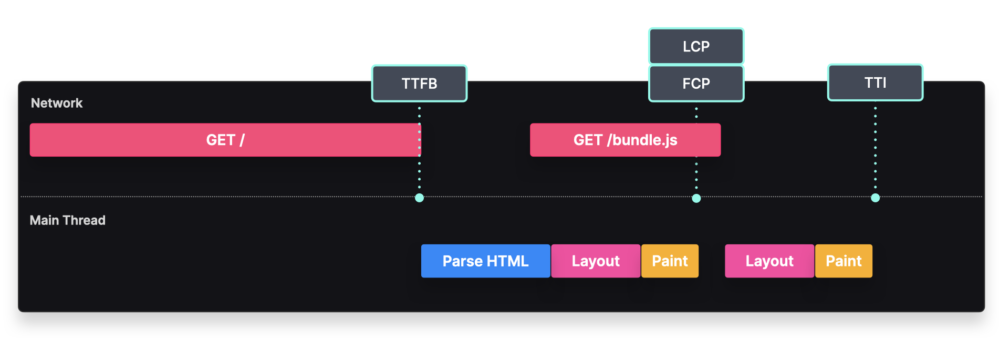
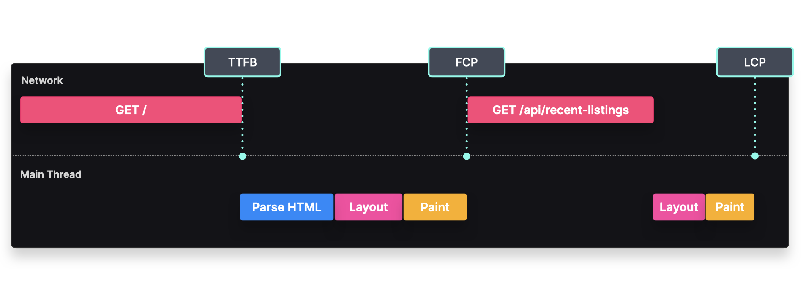

# Renderizado Estático
### Entrega contenido HTML pre-renderizado que se generó cuando se construyó el sitio

## Descripción
Con el renderizado estático, el contenido HTML se genera previamente en el momento de la construcción del sitio.

### **Paso 1**
**El cliente solicita HTML al servidor**

---

### **Paso 2**
**El servidor devuelve el HTML solicitado**

---

### **Paso 3**
**El navegador analiza y renderiza el contenido**

---

### **Paso 4**
**El cliente solicita el paquete de JavaScript al servidor**

---

### **Paso 5**
**El navegador hidrata los elementos**

Cuando un usuario solicita una aplicación renderizada de forma estática, el servidor responde con el archivo HTML.

Una vez que el cliente recibe este archivo HTML, el analizador HTML procesa el contenido y renderiza el contenido no interactivo en la pantalla. Si hay una etiqueta `script`, el cliente envía una solicitud adicional para obtener este paquete de JavaScript.

Cuando el cliente ha descargado el JavaScript, lo ejecuta y agrega event listeners a los elementos HTML para hacerlos interactivos.

---

## Implementación
El requisito mínimo para una aplicación renderizada estáticamente es tener un único archivo HTML que contenga todos los elementos necesarios para renderizarse en pantalla.

```javascript
const listings = [
  { id: 1, address: "..." },
  { id: 2, address: "..." },
];

export default function Home() {
  return <Listings listings={listings} />;
}
```

También puede haber un archivo JavaScript opcional, que solo es necesario si los componentes son interactivos, para enlazar event listeners a los elementos HTML ya renderizados.

---

## Ventajas y Desventajas

### **Rendimiento**


- **TTFB**: El tiempo hasta el primer byte puede ser rápido, ya que el HTML inicial no contiene componentes grandes.
- **FCP**: La primera pintura con contenido puede ocurrir una vez que el paquete de JavaScript ha sido descargado, analizado y ejecutado.
- **TTI**: El tiempo hasta que la página es interactiva puede ocurrir una vez que el paquete de JavaScript ha sido descargado, analizado y ejecutado para enlazar los controladores de eventos a los componentes.
- **LCP**: La mayor pintura con contenido puede ocurrir al mismo tiempo que el FCP, siempre que no haya componentes grandes como imágenes o videos.

### **Otros Aspectos**

- **Cacheabilidad**: Los archivos HTML pre-renderizados pueden ser almacenados en caché y servidos por una CDN global. Los usuarios se benefician de respuestas rápidas sin necesidad de llegar al servidor de origen.
- **SEO**: Los motores de búsqueda pueden renderizar el contenido HTML sin esfuerzo adicional.
- **Disponibilidad**: Las páginas estáticas siempre están en línea. Incluso si el backend o la base de datos falla, la página pre-renderizada seguirá estando disponible.
- **Carga del servidor**: No es necesario consultar la base de datos o la API en cada solicitud, lo que reduce la carga en el servidor.

---

## Datos Dinámicos
Las páginas estáticas a veces requieren contenido dinámico. La principal diferencia es **cuándo** se recuperan estos datos.

### **Obtener datos dinámicos en el momento de la construcción**

Podemos obtener datos del servidor en el momento de la construcción y generar el HTML en función de estos datos. Frameworks como Next.js ofrecen métodos integrados para agregar datos dinámicos a páginas estáticas.

#### **Implementación (Next.js)**

```javascript
import { Listings } from "../components";

export default function Home(props) {
  return <Listings listings={props.listings} />;
}

export async function getStaticProps() {
  const res = await fetch("https://my.cms.com/listings");
  const listings = await res.json();

  return { props: { listings } };
}
```

Este método se ejecuta en el servidor en el momento de la construcción, generando HTML que contiene los datos obtenidos.

### **Ventajas y Desventajas**



- **Beneficios del renderizado estático**: Conserva todas las ventajas del renderizado estático, como la cacheabilidad, el buen SEO, la alta disponibilidad y la baja carga del backend.
- **Datos dinámicos**: El método `getStaticProps` permite usar datos dinámicos y renovar los datos en el momento de la construcción.
- **Requiere redeploy para actualizar los datos**: Los datos solo se actualizan cuando se reconstruye y se vuelve a desplegar el sitio.
- **Tiempos de construcción largos**: Si la aplicación contiene muchas páginas pre-renderizadas, los tiempos de construcción pueden ser prolongados.

---

## Obtener datos dinámicos en el cliente

Recuperar datos dinámicos en **el cliente** es otra opción, ideal para contenido que debe actualizarse en cada solicitud.

### **Pasos**

### **Paso 1**
**El cliente solicita HTML al servidor**

---

### **Paso 2**
**El servidor devuelve HTML, Edge almacena en caché la respuesta**

---

### **Paso 3**
**El navegador analiza y renderiza el contenido**

---

### **Paso 4**
**El cliente solicita datos a la API**

---

### **Paso 5**
**El navegador renderiza los datos**

### **Implementación (Librería SWR)**

```javascript
import useSWR from "swr";
import { Listings, ListingsSkeleton } from "../components";

export default function Home() {
  const { data, loading } = useSWR("/api/listings", (...args) =>
    fetch(...args).then((res) => res.json())
  );

  if (loading) {
    return <ListingsSkeleton />;
  }

  return <Listings listings={data.listings} />;
}
```

### **Ventajas y Desventajas**

### **Rendimiento**



- **TTFB**: Rápido, ya que el HTML inicial no contiene componentes grandes.
- **FCP**: Ocurre una vez que el HTML ha sido analizado y renderizado.
- **LCP**: Puede ocurrir al mismo tiempo que el FCP, siempre que no haya activos grandes como imágenes o videos.
- **TTI**: Ocurre una vez que el paquete de JavaScript ha sido descargado, analizado y ejecutado para enlazar los controladores de eventos.

### **Otros Aspectos**

- **Beneficios del renderizado estático**: Conserva las ventajas del renderizado estático, como la cacheabilidad, el SEO, la disponibilidad y la baja carga en el backend.
- **Costos del servidor**: Los datos se solicitan en cada carga de página, lo que puede aumentar los costos del servidor.
- **Desplazamiento del diseño (Layout Shift)**: Puede ocurrir si los componentes de esqueleto no coinciden con los tamaños de los componentes renderizados.

