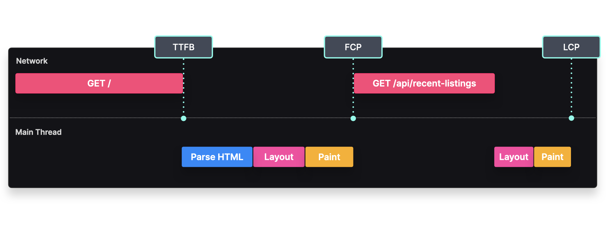

# Regeneración Estática Incremental
## Pre-renderizar ciertas páginas y renderizar otras bajo demanda

### Visión General
La renderización estática ofrece muchos beneficios en términos de rendimiento, pero puede resultar en tiempos de compilación largos si tenemos muchas páginas para pre-renderizar. Además, solo podemos actualizar el contenido de nuestra página al volver a desplegar el sitio web, lo que no es una gran experiencia para el usuario.

La Regeneración Estática Incremental nos permite pre-renderizar solo un subconjunto de páginas, por ejemplo, aquellas que probablemente serán solicitadas por los usuarios, y renderizar el resto bajo demanda. Cuando un usuario solicita una página que aún no ha sido pre-renderizada, la página se renderiza en el servidor y luego se almacena en caché en un CDN.

Además de pre-renderizar solo un subconjunto de páginas, también podemos invalidar automáticamente las páginas en caché utilizando un enfoque de **stale-while-revalidate**. Cuando un usuario solicita una página que está desactualizada (es decir, ha estado en caché más tiempo del permitido), se activa la regeneración en segundo plano. Mientras esto sucede, el usuario sigue viendo la página desactualizada, pero podrá ver el contenido actualizado en solicitudes posteriores.

---

### **Paso 1**  
**El cliente solicita HTML al servidor**  

---

### **Paso 2**  
**El servidor devuelve HTML desactualizado al cliente.**  

---

### **Paso 2.1**  
**Se activa la regeneración**  

---

### **Paso 2.2**  
**La página se regenera en una función serverless desplegada**  

---

### **Paso 2.3**  
**La caché se invalida y se reemplaza con la nueva página**  

---

## Implementación
Podemos implementar la Regeneración Estática Incremental en Next.js usando el método `getStaticProps` en combinación con `getStaticPaths`.

```javascript
import { Listings, ListingsSkeleton } from "../components";

export default function Listing(props) {
  return <ListingLayout listings={props.listing} />
}

export async function getStaticProps(props) {
  const res = await fetch(`https://my.cms.com/listings/${props.params.id}`);
  const { listing } = await res.json();

  return { props: { listing } }
}

export function getStaticPaths() {
  const res = await fetch(`https://my.cms.com/listings?limit=20`);
  const { listings } = await res.json();

  return {
    params: listings.map(listing => ({ id: listing.id })),
    fallback: false
  }
}
```

---

## Compromisos
### **Rendimiento**



- **TTFB**: El tiempo hasta el primer byte puede ser rápido, ya que el HTML inicial no contiene componentes grandes.
- **FCP**: El primer renderizado de contenido puede ocurrir una vez que el HTML ha sido analizado y renderizado.
- **LCP**: El renderizado del contenido más grande puede ocurrir al mismo tiempo que el primer renderizado de contenido, siempre que no haya componentes grandes como imágenes o videos.
- **TTI**: El tiempo hasta la interactividad puede ocurrir una vez que el HTML ha sido renderizado y el paquete de JavaScript ha sido descargado, analizado y ejecutado para enlazar los manejadores de eventos a los componentes.

### **Otras Consideraciones**

- **Beneficios estáticos**: Como seguimos generando archivos HTML de forma estática, podemos beneficiarnos de todas las ventajas de la renderización estática, como la capacidad de almacenamiento en caché, un buen SEO, alta disponibilidad y una baja carga en el backend.
- **Costos del servidor**: Puede suceder que nuestros datos no se actualicen en cada intervalo definido, lo que puede provocar una invalidación innecesaria de la caché y una regeneración de la página.