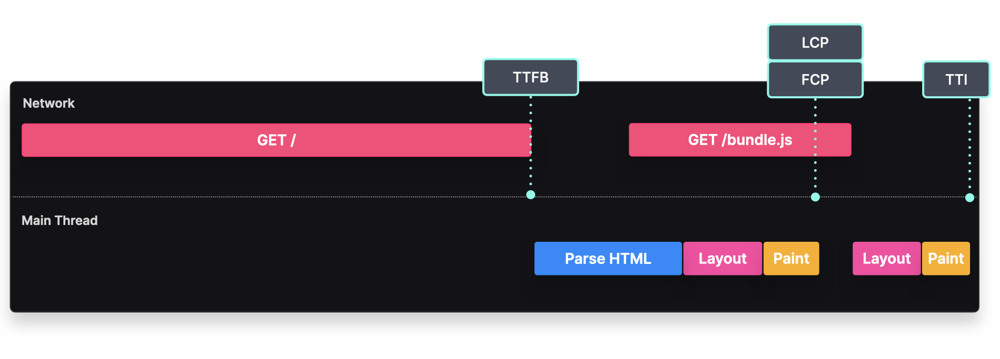

### Server-Side Rendering (SSR)

#### Generate HTML on every request

### Overview
With Server-Side Rendering, we generate HTML on the server (or a serverless function) for every request.

---

### **Step 1**  
**Client requests HTML from the server**  

---

### **Step 2**  
**Server generates and returns HTML**  

---

### **Step 3**  
**Browser parses and renders the content**  

---

### **Step 4**  
**Client requests the JavaScript bundle**  

---

### **Step 5**  
**Browser hydrates elements for interactivity**  

---

When a user requests a server-side rendered page, the server processes the request, generates the HTML, and returns it to the client.

The browser renders this content, initially as static non-interactive HTML elements. To enable interactivity, the client fetches the JavaScript bundle, which hydrates the components by binding event listeners to the HTML elements.

---

### Implementation
To implement SSR, we need a method to render React components into an HTML string on the server and hydrate the non-interactive HTML on the client. React provides the `renderToString` method for server-side rendering and the `hydrateRoot` method for client-side hydration.

---

### **Client-side Hydration (client.js)**
```javascript
ReactDOM.hydrateRoot(document.getElementById("root"), <App />);
```

### **Server-side Rendering (server.js)**
```javascript
import ReactDOMServer from "react-dom/server";
const html = ReactDOMServer.renderToString(<App />);
```

### **Explanation**
1. **Server-side (server.js)**:
   - Uses `ReactDOMServer.renderToString(<App />)` to generate a fully rendered HTML string.
   - The generated HTML is sent to the client, ensuring a fast initial page load.

2. **Client-side (client.js)**:
   - Uses `ReactDOM.hydrateRoot(document.getElementById("root"), <App />)` to attach event listeners and make the page interactive.

Frameworks like **Next.js**, **Remix**, and **Astro** simplify SSR implementation.

#### Example in Next.js using `getServerSideProps`:
```javascript
import { Listings } from "../components";

export default function Home({ listings }) {
  return <Listings listings={listings} />;
}

export async function getServerSideProps() {
  const res = await fetch("https://my.cms.com/listings");
  const { listings } = await res.json();

  return {
    props: { listings },
  };
}
```

---

### Tradeoffs

#### Performance Considerations



- **TTFB (Time To First Byte):** Can be slower since the page is generated on demand.
- **FCP (First Contentful Paint):** Occurs once the HTML is parsed and rendered.
- **LCP (Largest Contentful Paint):** Usually aligns with the First Contentful Paint unless the page contains large media elements.
- **TTI (Time To Interactive):** Happens once the JavaScript bundle is downloaded, parsed, and executed.

#### Benefits
- **Personalized Pages:** Server rendering is useful for pages requiring request-based data, such as those using cookies or authentication.
- **SEO-Friendly:** Since the server returns fully rendered HTML, search engines can easily index the content.

#### Challenges
- **Render Blocking:** SSR can delay the page load for authentication-based content.
- **Longer Initial Load:** Since the page is generated per request, initial rendering can be slow.
- **Availability Issues:** If the server or its region goes down, the site becomes unavailable.
- **Performance Optimization Needed:**
  - Optimize database queries to reduce request latency.
  - Use **Cache-Control** headers to improve response times.
  - Consider a **CDN (Content Delivery Network)** to distribute content globally.

By understanding the tradeoffs and optimizations, Server-Side Rendering can be an effective approach for performance and SEO benefits.