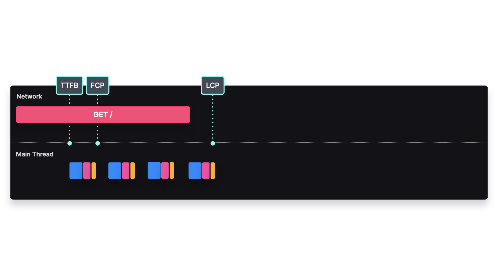

Aquí tienes la versión en español de **Streaming Server-Side Rendering**.

---

### **Renderizado en Streaming del Lado del Servidor**  
**Genera HTML en cada solicitud, enviándolo por partes**  

---

### **Descripción General**  
El renderizado en streaming del lado del servidor (**Streaming SSR**) permite enviar componentes al cliente **tan pronto como se generan**, en lugar de esperar a que toda la página esté lista.  

Con el **SSR tradicional**, el usuario debe esperar a que el servidor genere el HTML completo antes de recibir cualquier contenido. Además, la hidratación no puede comenzar hasta que el **bundle de JavaScript se haya descargado y ejecutado**.  

Con **Streaming SSR**, en cambio, los componentes **se envían progresivamente** a medida que están listos, mejorando el **Tiempo hasta el Primer Byte (TTFB)** y ofreciendo **una mejor experiencia de carga percibida** para los usuarios.  

---

### **Implementación**  

### **Ventajas y Desventajas**  

#### **Rendimiento**

- **TTFB más rápido:** Al enviar el primer byte antes, los usuarios ven contenido antes.
- **Beneficios del Streaming:** Las páginas grandes no bloquean la renderización, ya que los componentes se cargan progresivamente.
- **Uso eficiente de recursos:** **Manejo de la presión de red (Network Backpressure)** → Evita que las solicitudes pesadas bloqueen las más ligeras.

#### **Limitaciones**
- **No todos los entornos admiten HTTP Streaming** → Algunos entornos serverless (por ejemplo, AWS Lambda) pueden no soportarlo.
- **Complejidad en la hidratación** → Los componentes deben hidratarse correctamente a medida que llegan al cliente.

---

### **Siguiente: Hidratación Progresiva**  
¿Te gustaría continuar con **Hidratación Progresiva** a continuación? 🚀