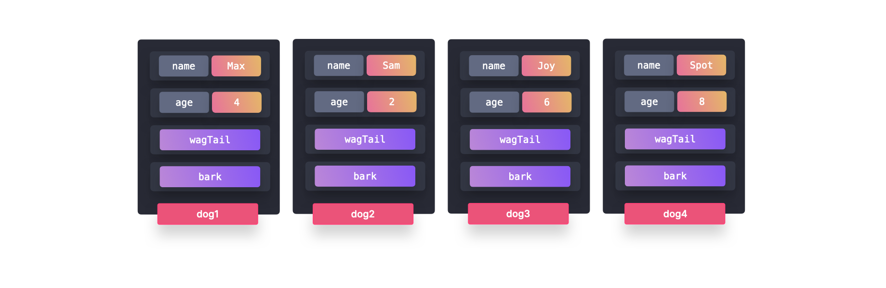

# Prototype Pattern in JavaScript

## Introduction
This README contains notes on the **Prototype Pattern** in JavaScript. The Prototype Pattern allows multiple objects of the same type to share properties and methods efficiently by leveraging JavaScript's prototype chain.

## Topics Covered
- What is the Prototype Pattern?
- How does it work?
- Implementation in JavaScript
  - Using a factory function (less efficient)
  - Using ES6 classes (prototype-based)
- Trade-offs of the Prototype Pattern
- Additional Information on JavaScript's Prototype Inheritance

## What is the Prototype Pattern?
The **Prototype Pattern** is a design pattern that enables objects to share methods efficiently. Instead of allocating memory for each function in every instance, the methods are stored in the **prototype** of the constructor function or class, allowing all instances to access them without redundancy.

### Why use the Prototype Pattern?
- **Reduces memory usage** by avoiding method duplication across instances.
- **Encapsulates shared behavior** in a single place (the prototype).
- **Improves performance** when creating multiple similar objects.

## Implementation in JavaScript

### Less Efficient Approach: Using a Factory Function
A **factory function** creates objects dynamically but allocates memory for methods every time a new object is created.

```javascript
const createDog = (name, age) => ({
  name,
  age,
  bark() {
    console.log(`${name} is barking!`);
  },
  wagTail() {
    console.log(`${name} is wagging their tail!`);
  },
});

const dog1 = createDog("Max", 4);
const dog2 = createDog("Sam", 2);
const dog3 = createDog("Joy", 6);
const dog4 = createDog("Spot", 8);
```


#### Problem with Factory Functions
Each new object created has its own copy of the `bark` and `wagTail` functions, leading to unnecessary memory allocation.

---

### More Efficient Approach: Using Prototypes (ES6 Classes)
A **prototype-based** approach ensures that all instances share the same methods without duplication.

```javascript
class Dog {
  constructor(name, age) {
    this.name = name;
    this.age = age;
  }

  bark() {
    console.log(`${this.name} is barking!`);
  }

  wagTail() {
    console.log(`${this.name} is wagging their tail!`);
  }
}

const dog1 = new Dog("Max", 4);
const dog2 = new Dog("Sam", 2);
const dog3 = new Dog("Joy", 6);
const dog4 = new Dog("Spot", 8);
```


#### Prototype Chain
When an instance is created using `new Dog()`, JavaScript stores shared methods (`bark` and `wagTail`) in the **prototype** of the `Dog` class.

```javascript
console.log(dog1);
// Output: Dog { name: "Max", age: 4 }
```

Even though the instance does not explicitly contain `bark` and `wagTail`, they are available through **prototype inheritance**:
```javascript
console.log(dog1.__proto__);
// Output: Dog.prototype { bark: ƒ, wagTail: ƒ }
```

Since all instances of `Dog` share the same prototype, they do not need separate memory allocations for these methods.

## Trade-offs of the Prototype Pattern

### Advantages
1. **Memory Efficiency**:  
   - Methods are shared through the prototype, reducing memory overhead.

2. **Encapsulation of Shared Behavior**:  
   - Helps maintain cleaner and DRY (Don't Repeat Yourself) code.

### Disadvantages
1. **Readability Issues**:  
   - If a class has been extended multiple times, it can be difficult to trace where certain properties or methods originated from.
   - Example: If `BorderCollie` extends `Dog`, which extends `Animal`, it may be challenging to determine where `wagTail` or `bark` were originally defined.
   

## Additional Information: JavaScript's Prototype Inheritance
Every object in JavaScript automatically **inherits** from the built-in `Object.prototype`, unless explicitly overridden.

- This is why primitive data types (e.g., `String`, `Array`, `Number`) have built-in methods (`.toUpperCase()`, `.map()`, `.toFixed()`), which are inherited from their respective prototypes.

```javascript
console.log("hello".toUpperCase()); // Output: "HELLO"
console.log([1, 2, 3].map(num => num * 2)); // Output: [2, 4, 6]
```

## Conclusion
The Prototype Pattern is a powerful way to optimize memory usage while ensuring objects share common methods. By leveraging JavaScript's built-in prototype inheritance, developers can create efficient, structured applications without unnecessary memory overhead. However, readability challenges may arise when dealing with deeply extended prototypes, making it essential to maintain clear and modular code structures.

