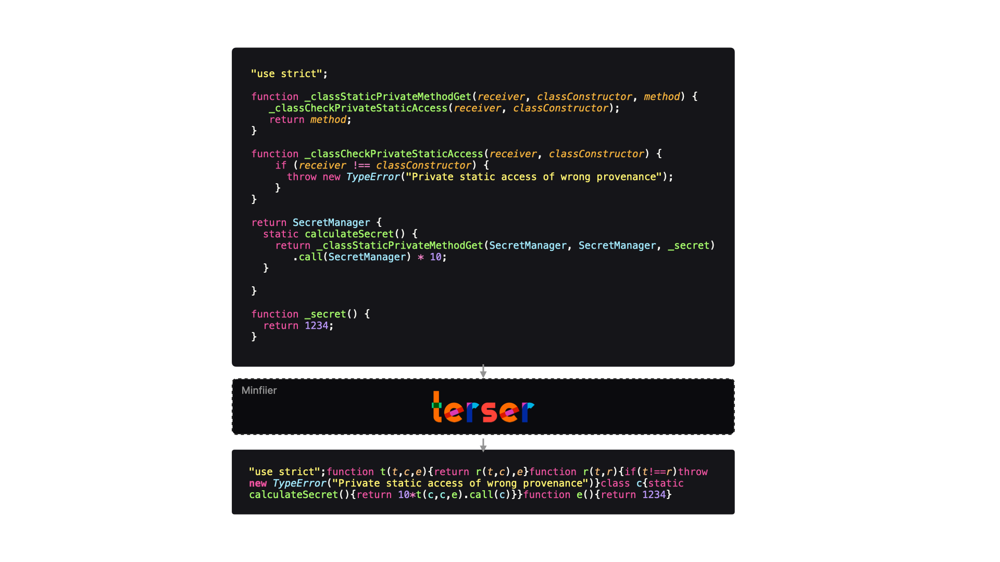

# Performance Patterns in JavaScript

## Overview
Performance patterns can be used to achieve a better **user** and **developer experience**.

Any client-side JavaScript in our application has to be shipped to the client. Before this happens, we must ensure that:
- The JavaScript is executable in a browser environment.
- The browser downloads only the **necessary** code, to reduce loading time and bandwidth usage.

---

## Tools

### Bundlers
A **bundler** packages our application into one or multiple files, making the code executable in different environments (e.g., browsers). A bundler starts from an **entry file** and traverses imports to include all necessary modules in the final bundle.

> **Note:** The term **bundle** refers to a single or multiple files that contain all required JavaScript code for execution.

#### **Example of Bundling**

##### **module1.js**
```javascript
export function module1() {
  return "Module 1";
}
```

##### **module2.js**
```javascript
import { module1 } from "./module1";

export function module2() {
  return `Module 2, ${module1()}`;
}
```

##### **module3.js**
```javascript
import { module2 } from "./module2";

export function module3() {
  return `Module 3, ${module2()}`;
}
```

##### **index.js**
```javascript
import { module3 } from "./module3";

console.log(`All imported modules: ${module3()}`);
```

##### **Output Bundle**
```javascript
(()=>{"use strict";function o(){return"Module 1"}function n(){return"Module 2, "+o()}console.log("All imported modules: "+(()=>`Module 3, ${n()}`)())})();
```

The way a bundler creates the output file(s) is configurable.

#### **Popular Bundlers:**
- **Webpack**
- **Parcel**
- **Rollup**

---

### Compilers
A **compiler** transforms JavaScript (or TypeScript) into another version of JavaScript, making it compatible with **older browsers** or **server environments**.

For example, JavaScript **Private Class Fields** are not supported in all browsers. A compiler can transform this syntax into an older version that browsers understand.

> **Note:** A compiler does **not** bundle code; it **only** transforms it.

#### **Popular Compilers:**
- **Babel**
- **TypeScript**


---

### Minifiers
A **minifier** reduces the size of JavaScript files by:
- Removing comments.
- Shortening variable and function names.
- Removing unnecessary whitespace.

This results in **smaller file sizes** and **faster execution**, without altering functionality.

##### **Example of Minified Code**

###### **Original Code**
```javascript
function add(a, b) {
  return a + b;
}
console.log(add(2, 3));
```

###### **Minified Code**
```javascript
console.log((function(n,o){return n+o})(2,3));
```



#### **Popular Minifiers:**
- **Terser**
- **UglifyJS**

---

### Combination of Tools
A bundler (like Webpack) is often configured to include a **compiler** (like Babel) and optimizations like a **minifier** (like Terser).

Some tools combine all three steps:
- **SWC** (Rust-based compiler, bundler, and minifier)
- **ESBuild** (Go-based compiler, bundler, and minifier)

---

## Best Practices

### Bundle Splitting
Instead of one large JavaScript bundle, **bundle splitting** creates multiple smaller bundles.

#### **Why?**
- **Reduces loading time**: Smaller bundles download and execute faster.
- **Improves performance**: Users on **low-end devices** or **slow networks** experience quicker load times.

#### **How?**
We configure the bundler to generate separate bundles for different parts of the application.

---

### Tree Shaking
**Tree shaking** removes **unused code** from the final JavaScript bundle.

#### **Example**
##### **input.js**
```javascript
export function validateInput(input) {
  return input.length > 10;
}

export function formatInput(input) {
  return input.toLowerCase();
}
```
##### **index.js**
```javascript
import { validateInput } from "./input";

const input = document.getElementById("input");
const btn = document.getElementById("btn");

btn.addEventListener("click", () => {
  validateInput(input.value);
});
```

In this case, the function `formatInput` is **never used**. The bundler will **exclude** it from the final bundle.


---

## Conclusion
By applying **performance patterns**, we can:
- **Reduce JavaScript file sizes** (minification, tree shaking).
- **Improve execution speed** (bundle splitting, efficient compilers).
- **Ensure browser compatibility** (compilers like Babel and TypeScript).

These patterns help **enhance user experience** and **optimize development workflows**.

