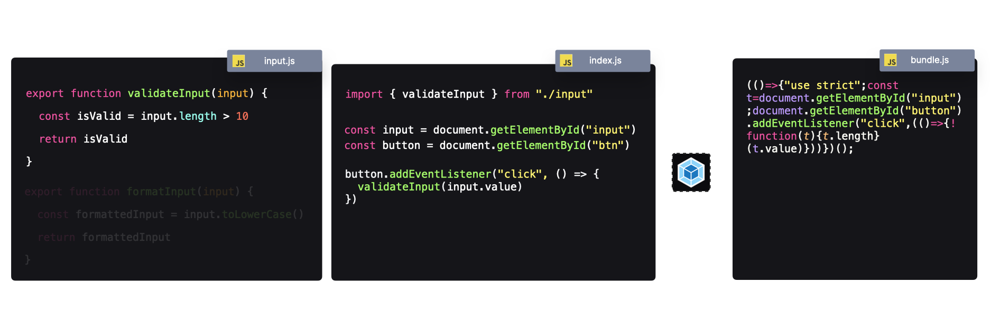

# Patrones de Rendimiento en JavaScript

## Descripción
Los **patrones de rendimiento** se utilizan para mejorar la **experiencia del usuario** y la **experiencia del desarrollador**.

Cualquier JavaScript en el lado del cliente debe ser enviado al navegador. Antes de que esto suceda, debemos asegurarnos de que:
- El código JavaScript sea ejecutable en un entorno de navegador.
- El navegador descargue solo el código **necesario**, para reducir el tiempo de carga y el uso de ancho de banda.

---

## Herramientas

### Bundlers
Un **bundler** empaqueta nuestra aplicación en uno o varios archivos, permitiendo que el código sea ejecutable en diferentes entornos (por ejemplo, navegadores). Un bundler comienza desde un **archivo de entrada** y recorre las importaciones para incluir todos los módulos necesarios en el paquete final.

> **Nota:** El término **bundle** se refiere a un archivo o conjunto de archivos que contienen todo el código JavaScript requerido para la ejecución.

#### **Ejemplo de Bundling**

##### **module1.js**
```javascript
export function module1() {
  return "Módulo 1";
}
```

##### **module2.js**
```javascript
import { module1 } from "./module1";

export function module2() {
  return `Módulo 2, ${module1()}`;
}
```

##### **module3.js**
```javascript
import { module2 } from "./module2";

export function module3() {
  return `Módulo 3, ${module2()}`;
}
```

##### **index.js**
```javascript
import { module3 } from "./module3";

console.log(`Todos los módulos importados: ${module3()}`);
```

##### **Salida del Bundle**
```javascript
(()=>{"use strict";function o(){return"Módulo 1"}function n(){return"Módulo 2, "+o()}console.log("Todos los módulos importados: "+(()=>`Módulo 3, ${n()}`)())})();
```

La forma en que un bundler genera el archivo de salida es configurable.

#### **Bundlers Populares:**
- **Webpack**
- **Parcel**
- **Rollup**

---

### Compiladores
Un **compilador** transforma JavaScript (o TypeScript) en otra versión de JavaScript, haciéndolo compatible con **navegadores antiguos** o **entornos de servidor**.

Por ejemplo, las **clases con campos privados** en JavaScript no son compatibles con todos los navegadores. Un compilador puede transformar esta sintaxis a una versión más antigua comprensible por los navegadores.

> **Nota:** Un compilador **no** empaqueta el código; **solo** lo transforma.

#### **Compiladores Populares:**
- **Babel**
- **TypeScript**


---

### Minificadores
Un **minificador** reduce el tamaño de los archivos JavaScript al:
- Eliminar comentarios.
- Reducir los nombres de variables y funciones.
- Eliminar espacios en blanco innecesarios.

Esto da como resultado **archivos más pequeños** y **ejecución más rápida**, sin alterar la funcionalidad.

##### **Ejemplo de Código Minificado**

###### **Código Original**
```javascript
function add(a, b) {
  return a + b;
}
console.log(add(2, 3));
```

###### **Código Minificado**
```javascript
console.log((function(n,o){return n+o})(2,3));
```


#### **Minificadores Populares:**
- **Terser**
- **UglifyJS**

---

### Combinación de Herramientas
Un bundler (como Webpack) a menudo se configura para incluir un **compilador** (como Babel) y optimizaciones como un **minificador** (como Terser).

Algunas herramientas combinan los tres pasos:
- **SWC** (Compilador, bundler y minificador basado en Rust)
- **ESBuild** (Compilador, bundler y minificador basado en Go)

---

## Mejores Prácticas

### División de Bundles
En lugar de un solo bundle grande, la **división de bundles** crea varios bundles más pequeños.

#### **¿Por qué?**
- **Reduce el tiempo de carga**: Los bundles pequeños se descargan y ejecutan más rápido.
- **Mejora el rendimiento**: Los usuarios con **dispositivos de gama baja** o **redes lentas** experimentan tiempos de carga más rápidos.

#### **¿Cómo?**
Se configura el bundler para generar bundles separados en lugar de uno solo.

---

### Tree Shaking
**Tree shaking** elimina **código no utilizado** del bundle final.

#### **Ejemplo**
##### **input.js**
```javascript
export function validateInput(input) {
  return input.length > 10;
}

export function formatInput(input) {
  return input.toLowerCase();
}
```
##### **index.js**
```javascript
import { validateInput } from "./input";

const input = document.getElementById("input");
const btn = document.getElementById("btn");

btn.addEventListener("click", () => {
  validateInput(input.value);
});
```

En este caso, la función `formatInput` **nunca se usa**. El bundler la **excluirá** del bundle final.



---

## Conclusión
Aplicando **patrones de rendimiento**, podemos:
- **Reducir el tamaño de los archivos JavaScript** (minificación, tree shaking).
- **Mejorar la velocidad de ejecución** (división de bundles, compiladores eficientes).
- **Asegurar la compatibilidad con navegadores** (compiladores como Babel y TypeScript).

Estos patrones ayudan a **mejorar la experiencia del usuario** y **optimizar el flujo de trabajo del desarrollo**.

