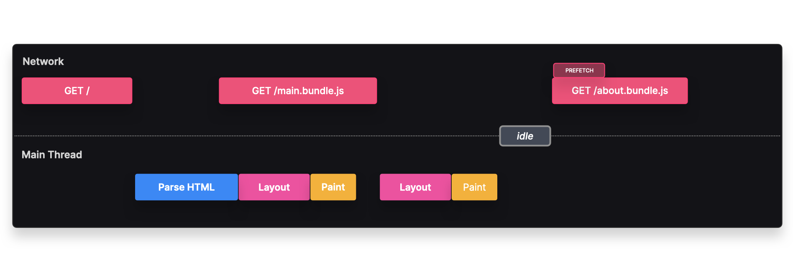
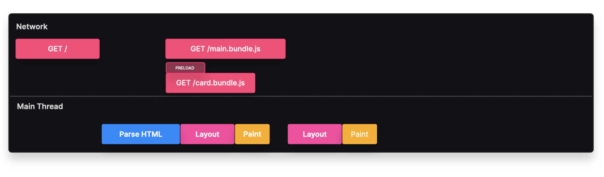

# Indicaciones del Navegador

## Prefetch
### Obtener y almacenar en caché recursos que podrían ser solicitados pronto

### Descripción
La indicación del navegador **prefetch** permite obtener recursos que **podrían** ser necesarios en el futuro pero **no inmediatamente** en la carga inicial. Esto es útil para solicitudes de navegación posteriores que el usuario **probablemente** realizará.

Un **recurso prefetch** se obtiene cuando el navegador está **inactivo** y tiene suficiente ancho de banda. Luego, el recurso se almacena en caché para que, cuando el cliente realmente lo necesite, pueda recuperarlo **instantáneamente** sin realizar una solicitud al servidor.



---

> **Ejemplo:** Si utilizamos **división de rutas** y sabemos que la mayoría de los usuarios navegan a la ruta `/about`, podemos hacer prefetch de esta ruta para una navegación más rápida y una mejor experiencia de usuario.

En lugar de esperar la interacción del usuario para obtener `about.bundle.js`, el navegador **prefetch** este recurso cuando está inactivo. Cuando el usuario navega a `/about`, el bundle se carga desde la caché en lugar de solicitarlo al servidor.

---

### **Implementación**
Podemos hacer prefetch de un recurso agregándolo explícitamente al **head** del documento HTML:

```html
<link rel="prefetch" href="./about.bundle.js" />
```

Si usamos **Webpack**, podemos hacer prefetch dinámicamente usando el comentario mágico **`/* webpackPrefetch: true */`**:

```javascript
const About = lazy(() => import(/* webpackPrefetch: true */ "./about"));
```

### **Ejemplo con React Router**
```javascript
import React, { lazy, Suspense } from 'react';
import { createRoot } from 'react-dom/client';
import {
  Routes,
  Route,
  BrowserRouter as Router,
  Link,
  Outlet,
} from 'react-router-dom';

const App = lazy(() => import('./pages/App'));
const About = lazy(() =>
  import(/* webpackPrefetch: true, webpackChunkName: "about" */ './pages/About')
);
const Contact = lazy(() => import('./pages/Contact'));

export function Nav() {
  return (
    <div>
      <nav>
        <h1>
          <Link to="/">
            <span>🏡</span> Casas.
          </Link>
        </h1>
        <ul>
          <li><Link to="/about">Acerca de</Link></li>
          <li><Link to="/contact">Contacto</Link></li>
        </ul>
      </nav>
      <Outlet />
    </div>
  );
}

createRoot(document.getElementById('root')).render(
  <Router>
    <Suspense fallback={<div>Cargando...</div>}>
      <Routes>
        <Route path="/" element={<Nav />}>
          <Route path="/about" element={<About />} />
          <Route path="/contact" element={<Contact />} />
        </Route>
      </Routes>
    </Suspense>
  </Router>
);
```

### **Ventajas y Desventajas**
✅ **Carga más rápida** → Los recursos con prefetch se cargan rápidamente desde la caché sin necesidad de hacer una solicitud de red.
❌ **Solicitudes innecesarias** → Si el usuario nunca navega a `/about`, el recurso prefetched **consume ancho de banda innecesariamente**.

---

## Preload
### Informar al navegador sobre recursos críticos antes de que sean descubiertos

### Descripción
La indicación del navegador **preload** obtiene recursos **críticos** para la **navegación actual**, como fuentes o imágenes visibles **dentro de los primeros 3 segundos** de carga de la página.



A diferencia de **prefetch**, un **recurso preloaded** **siempre** se obtiene, incluso si las condiciones de red no son óptimas.

> **Ejemplo:** Si queremos que `SearchFlyout` aparezca **instantáneamente** en la página de inicio, podemos **preload** este recurso para garantizar su rápida disponibilidad.

En lugar de obtener `search-flyout.bundle.js` después de que la página se haya cargado, preloading **obtiene el recurso en paralelo** con `main.bundle.js`. Cuando se necesita, se carga instantáneamente desde la caché.

---

### **Implementación**
Podemos hacer preload de un recurso agregándolo explícitamente al **head** del documento HTML:

```html
<link rel="preload" href="./search-flyout.bundle.js" />
```

Si usamos **Webpack**, podemos hacer preload dinámicamente usando el comentario mágico **`/* webpackPreload: true */`**:

```javascript
const SearchFlyout = lazy(() => import(/* webpackPreload: true */ "./SearchFlyout"));
```

---

### **Ventajas y Desventajas**
✅ **Carga más rápida** → Los recursos con preload se cargan instantáneamente desde la caché sin esperar una solicitud de red.
✅ **Reduce el cambio de diseño (layout shift)** → Preloading de fuentes, estilos e imágenes minimiza los cambios inesperados en la maquetación.
❌ **Costo en rendimiento** → Como los recursos preloaded **siempre** se obtienen, el preloading innecesario **consume ancho de banda**. En su lugar, considera hacer prefetch o usar atributos `async` o `defer` para scripts.

```html
<link href="./script" rel="preload" />
<script rel="defer" src="./script"></script>
```

