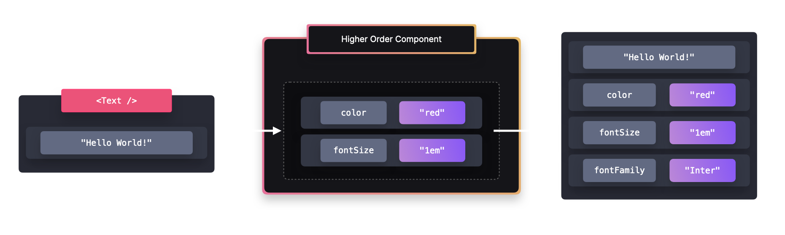

# Higher-Order Components (HOC) in React

## Introduction
This README contains notes on **Higher-Order Components (HOC)** in React. HOCs allow us to enhance and reuse component logic by wrapping them with additional functionality.

## Topics Covered
- What are Higher-Order Components?
- How do they work?
- Implementation in React
  - Applying logic to another component
  - Using HOCs for styling
  - Using HOCs for handling loading states
- Trade-offs of Higher-Order Components

## What are Higher-Order Components?
A **Higher-Order Component (HOC)** is a pattern that enables logic reusability by wrapping a component and adding additional functionality to it. This pattern is useful for:
- Applying shared logic to multiple components.
- Keeping components clean and focused on a single responsibility.
- Enhancing separation of concerns in large applications.

### Why use Higher-Order Components?
- **Reusability**: Avoid repeating logic in multiple components.
- **Separation of Concerns**: Extract non-UI logic into HOCs.
- **Enhancing Components Dynamically**: Modify components without changing their implementation.

## Implementation in React

### Applying Logic to Another Component
We can apply logic to another component by:
- Receiving another component as its argument.
- Applying additional logic to the passed component.
- Returning the same or a new component with added functionality.



### Example: Using HOCs for Styling
We can create an HOC that modifies the styles of a component.

```javascript
export function withStyles(Component) {
  return (props) => {
    const style = {
      color: "red",
      fontSize: "1em",
      // Merge props to avoid overriding existing styles
      ...props.style,
    };

    return <Component {...props} style={style} />;
  };
}
```

We can then wrap a component with `withStyles` to apply the styles dynamically.

```javascript
import { withStyles } from "./hoc/withStyles";

const Text = () => <p style={{ fontFamily: "Inter" }}>Hello world!</p>;
const StyledText = withStyles(Text);
```

Alternatively, we can wrap a component directly inside the HOC:

```javascript
const Text = withStyles(() => (
  <p style={{ fontFamily: "Inter" }}>Hello world!</p>
));
```

---

### Example: Using HOCs for Handling Loading States
A common use case for HOCs is managing loading states when fetching data.

```javascript
function withLoader(Component) {
  return function WrappedComponent({ isLoading, ...props }) {
    if (isLoading) {
      return <LoadingSpinner />;
    }
    return <Component {...props} />;
  };
}
```

We can then use it to wrap any component that needs a loading state:

```javascript
const DataComponent = ({ data }) => <div>{data}</div>;
const DataWithLoader = withLoader(DataComponent);

<DataWithLoader isLoading={true} data="Fetching data..." />;
```

## Trade-offs of Higher-Order Components

### Advantages
1. **Separation of Concerns**:  
   - HOCs centralize reusable logic, reducing the risk of duplication and potential bugs.

2. **Code Reusability**:  
   - HOCs allow easy extension of components with minimal changes to their core logic.

### Disadvantages
1. **Naming Collisions**:  
   - A HOC may unintentionally override props of a wrapped component. To prevent this, always merge or rename props properly.

   ```javascript
   function withStyles(Component) {
     return (props) => {
       const style = {
         padding: "0.2rem",
         margin: "1rem",
         ...props.style,
       };

       return <Component {...props} style={style} />;
     };
   }
   
   const Button = () => <button style={{ color: "red" }}>Click me!</button>;
   const StyledButton = withStyles(Button);
   ```

2. **Readability Issues**:  
   - When multiple HOCs wrap a component, it can be hard to trace which HOC adds which prop, making debugging difficult.

## Conclusion
Higher-Order Components are a powerful pattern for managing logic reuse in React applications. However, while they provide a flexible way to share functionality, their readability and potential naming conflicts should be carefully managed.

