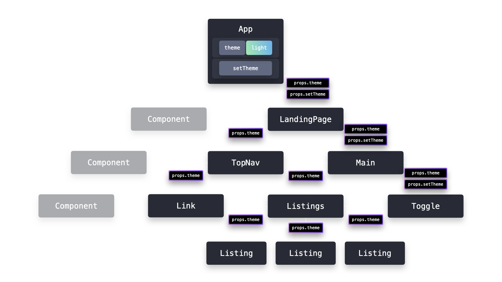

# Provider Pattern in React

## Overview
The **Provider Pattern** leverages React's Context API to easily share data among multiple components in an application.

### Key Benefits:
- Avoid **prop drilling** by making data globally accessible.
- Improve **scalability** and **performance** by reducing unnecessary re-renders.
- Facilitate **state management** by centralizing context data.

## Prop Drilling Problem
Before React introduced the Context API, passing data across multiple components led to **prop drilling**, where props had to be explicitly passed down through each level of the component tree. This approach:
- **Increases complexity** as the application scales.
- **Decreases flexibility**, making it hard to rename or restructure components.
- **Impacts performance**, as unnecessary re-renders occur in components that don’t need the data.



The **Provider Pattern** solves this by exposing context values globally to child components that opt-in to consume the data.

## Implementation
A **Provider** is a Higher-Order Component (HOC) created using `React.createContext`.

### Step 1: Create a Context
```javascript
export const ThemeContext = React.createContext(null);
```

### Step 2: Implement the Provider Component
```javascript
export function ThemeProvider({ children }) {
  const [theme, setTheme] = React.useState("light");

  return (
    <ThemeContext.Provider value={{ theme, setTheme }}>
      {children}
    </ThemeContext.Provider>
  );
}
```

Now, any component wrapped in `ThemeProvider` can access `theme` and `setTheme`.

### Step 3: Consuming Context using `<ThemeContext.Consumer>`
```javascript
import { ThemeProvider, ThemeContext } from "../context";

const LandingPage = () => (
  <ThemeProvider>
    <TopNav />
    <Main />
  </ThemeProvider>
);

const TopNav = () => (
  <ThemeContext.Consumer>
    {({ theme }) => (
      <div style={{ backgroundColor: theme === "light" ? "#fff" : "#000" }}>
        ...
      </div>
    )}
  </ThemeContext.Consumer>
);

const Toggle = () => (
  <ThemeContext.Consumer>
    {({ theme, setTheme }) => (
      <button
        onClick={() => setTheme(theme === "light" ? "dark" : "light")}
        style={{
          backgroundColor: theme === "light" ? "#fff" : "#000",
          color: theme === "light" ? "#000" : "#fff",
        }}
      >
        Use {theme === "light" ? "Dark" : "Light"} Theme
      </button>
    )}
  </ThemeContext.Consumer>
);
```

## Alternative: Using `useContext` Hook
Instead of wrapping components with `<ThemeContext.Consumer>`, we can use the `useContext` hook for better readability and performance.

### Step 1: Modify the Provider
```javascript
export function useThemeContext() {
  return React.useContext(ThemeContext);
}

export function ThemeProvider({ children }) {
  const [theme, setTheme] = React.useState("light");

  return (
    <ThemeContext.Provider value={{ theme, setTheme }}>
      {children}
    </ThemeContext.Provider>
  );
}
```

### Step 2: Consuming Context with `useThemeContext`
```javascript
import { useThemeContext } from "../context";

const TopNav = () => {
  const { theme } = useThemeContext();
  return (
    <div style={{ backgroundColor: theme === "light" ? "#fff" : "#000" }}>
      ...
    </div>
  );
};

const Toggle = () => {
  const { theme, setTheme } = useThemeContext();
  return (
    <button
      onClick={() => setTheme(theme === "light" ? "dark" : "light")}
      style={{
        backgroundColor: theme === "light" ? "#fff" : "#000",
        color: theme === "light" ? "#000" : "#fff",
      }}
    >
      Use {theme === "light" ? "Dark" : "Light"} Theme
    </button>
  );
};
```

Using the `useContext` hook makes the code cleaner and improves maintainability.

## Trade-offs

### Advantages
1. **Scalability**:  
   - **No prop drilling**, making state management easier as the application grows.
   - **Easier refactoring**, as renaming values or restructuring is straightforward.

2. **Performance**:  
   - **Only necessary components re-render** when the state changes.
   - **Avoids unnecessary renders** in components that don’t consume the context.

### Disadvantages
1. **Performance Considerations**:  
   - **All components using the context re-render when the value changes**, which can impact performance if not optimized.
   - **Use memoization techniques like `useMemo` or `React.memo`** to mitigate unnecessary renders.

## Conclusion
The **Provider Pattern** is a scalable way to share data across multiple components, improving maintainability and avoiding **prop drilling**. By combining it with **React Hooks (`useContext`)**, we can enhance performance and simplify state management.

