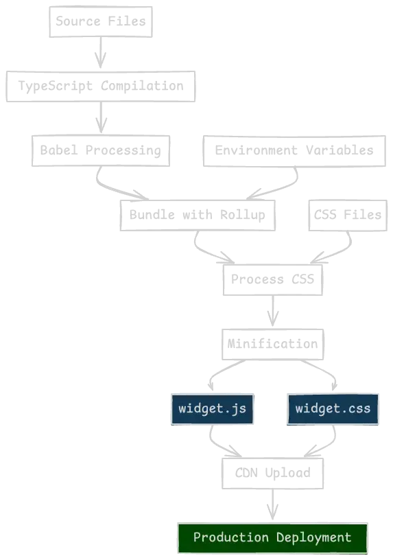
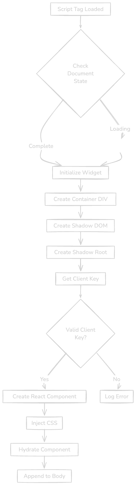

# Building an Embeddable React Widget with Vite, Rollup & Tailwind

This guide provides a **comprehensive** tutorial for creating a **production-ready, embeddable React widget** from scratch. We will cover everything from **project setup** with Vite to **bundling** via Rollup, **styling** with Tailwind CSS, **managing environments**, and **embedding** your widget on any website.

---
## 1. Project Setup

### 1.1 Creating a Vite Project

```bash
npm create vite@latest react-widget -- --template react-ts
cd react-widget
```

This sets up a new React + TypeScript project using Vite.

### 1.2 Installing Dependencies

We'll need both **core** and **dev** dependencies:

```bash
# Core dependencies
npm install react react-dom

# Development dependencies
npm install -D tailwindcss postcss tslib @rollup/plugin-babel
@rollup/plugin-commonjs
@rollup/plugin-node-resolve @rollup/plugin-typescript @rollup/plugin-terser
rollup rollup-plugin-postcss @babel/preset-react @babel/preset-typescript @types/react @types/react-dom typescript @types/node @rollup/plugin-replace rollup-plugin-polyfill-node rollup-plugin-tsconfig-paths rollup-plugin-visualizer rollup-plugin-inject-process-env dotenv

```

---
## 2. Project Structure

A suggested folder layout for clarity and maintainability:

```plaintext
react-embeddable-widget/
├── src/
│   ├── widget/
│   │   ├── components/
│   │   ├── lib/
│   │   ├── styles/
│   │   ├── index.tsx         (Widget entry point)
│   ├── App.tsx              (Test application)
│   ├── App.css
│   ├── main.tsx             (Vite entry)
│   ├── index.css
├── public/
├── index.html
├── package.json
├── tsconfig.json
├── vite.config.ts
├── .env.development
├── .env.production
├── rollup.config.mjs
├── tailwind.config.mjs
└── postcss.config.cjs
```

- **`src/widget/`**: Actual widget code (components, lib, styles, etc.).
- **`src/`**: Vite-based app for development/testing but not bundled with the widget.
- **`public/`**: Static assets.
- **`.env.*`**: Environment variables for development & production.
- **`rollup.config.mjs`**: Rollup config for bundling the widget.
- **`tailwind.config.mjs` & `postcss.config.cjs`**: Tailwind and PostCSS configs.

---
## 3. Adding Tailwind CSS

### 3.1 Initializing Tailwind

```bash
npx tailwindcss init -p
```

This creates a **`tailwind.config.js`** or **`tailwind.config.cjs`** (here we’ll rename to **`tailwind.config.mjs`** for ESM compatibility) and a **`postcss.config.js`** file.

### 3.2 Tailwind Configuration (`tailwind.config.mjs`)

```js
export default {
  content: [
    "./src/**/*.{js,jsx,ts,tsx}"
  ],
  theme: {
    extend: {},
  },
  plugins: [],
};
```

Specify the paths to your components so Tailwind can purge unused styles.

### 3.3 PostCSS Configuration (`postcss.config.cjs`)

```js
module.exports = {
  plugins: {
    tailwindcss: {},
    autoprefixer: {},
  },
};
```

### 3.4 Main CSS File

Create **`src/styles/style.css`** (or any name you prefer) to import Tailwind layers:

```css
@tailwind base;
@tailwind components;
@tailwind utilities;

/* Optionally add custom styles for your widget */
.widget-container {
  @apply fixed bottom-5 right-5 w-[300px] h-[400px] bg-white border border-gray-200 rounded-lg shadow-lg z-[9999];
}

.widget-button {
  @apply fixed bottom-5 right-5 px-6 py-3 bg-indigo-600 text-white border-none rounded-lg cursor-pointer z-[9999];
}

.widget-header {
  @apply p-3 border-b border-gray-200 flex justify-between items-center;
}

.widget-content {
  @apply p-4;
}
```

Then import this CSS inside your **widget entry** (e.g., `src/index.tsx`) or in the widget container component:

```tsx
import "./styles/style.css";
```

---
## 4. Configuration Files

### 4.1 Rollup Configuration (`rollup.config.mjs`)

Below is a **comprehensive** Rollup config that handles TypeScript, Babel, commonJS, node resolution, environment variables, polyfills, PostCSS, and minification.

```js
import babel from '@rollup/plugin-babel';
import commonjs from '@rollup/plugin-commonjs';
import nodeResolve from '@rollup/plugin-node-resolve';
import replace from '@rollup/plugin-replace';
import terser from '@rollup/plugin-terser';
import typescript from '@rollup/plugin-typescript';
import { config } from 'dotenv';
import { parseArgs } from 'node:util';
import injectProcessEnv from 'rollup-plugin-inject-process-env';
import nodePolyfills from 'rollup-plugin-polyfill-node';
import postcss from 'rollup-plugin-postcss';
import tsConfigPaths from 'rollup-plugin-tsconfig-paths';
import { visualizer } from 'rollup-plugin-visualizer';

const args = parseArgs({
  options: {
    environment: {
      type: 'string',
      short: 'e',
      default: 'development',
    },
    configuration: {
      type: 'string',
      short: 'c',
    },
  },
});

const env = args.values.environment;
const production = env === 'production';
console.log(`Building widget for ${env} environment...`);

// Load environment variables
const ENV_VARIABLES = config({
  path: production ? './.env.production' : './.env.development',
}).parsed;

// Name of the generated widget file
const fileName = ENV_VARIABLES.WIDGET_NAME || 'widget.js';

export default {
  input: './src/index.tsx',
  output: {
    file: `dist/${fileName}`,
    format: 'iife',
    sourcemap: false,
    inlineDynamicImports: true,
    globals: {
      'react/jsx-runtime': 'jsxRuntime',
      'react-dom/client': 'ReactDOM',
      react: 'React',
    },
  },
  plugins: [
    tsConfigPaths({ tsConfigPath: './tsconfig.json' }),
    replace({ preventAssignment: true }),
    typescript({ tsconfig: './tsconfig.json' }),
    nodeResolve({
      extensions: ['.tsx', '.ts', '.json', '.js', '.jsx', '.mjs'],
      browser: true,
      dedupe: ['react', 'react-dom'],
    }),
    babel({
      babelHelpers: 'bundled',
      presets: [
        '@babel/preset-typescript',
        [
          '@babel/preset-react',
          {
            runtime: 'automatic',
            targets: '>0.1%, not dead, not op_mini all',
          },
        ],
      ],
      extensions: ['.js', '.jsx', '.ts', '.tsx', '.mjs'],
    }),
    postcss({
      extensions: ['.css'],
      minimize: true,
      extract: true,
      inject: {
        insertAt: 'top',
      },
    }),
    commonjs(),
    nodePolyfills({ exclude: ['crypto'] }),
    injectProcessEnv(ENV_VARIABLES),
    terser({
      ecma: 2020,
      mangle: { toplevel: true },
      compress: {
        module: true,
        toplevel: true,
        unsafe_arrows: true,
        drop_console: true,
        drop_debugger: true,
      },
      output: { quote_style: 1 },
    }),
    visualizer(),
  ],
};
```

This configuration ensures:
- **TypeScript** compilation
- **Babel** transpilation
- **PostCSS** for Tailwind
- **Minification** & **Optimizations**
- **Environment variables** injected via `.env.*`
- **Bundle analysis** with `rollup-plugin-visualizer`



### 4.2 Scripts in `package.json`

```json
{
  "scripts": {
    "build": "vite build",
    "dev": "vite",
    "build:widget": "rollup -c ./rollup.config.mjs",
    "build:widget:production": "rollup -c ./rollup.config.mjs --environment=production",
    "serve": "npx http-server ./ --cors -p 3333",
    "serve:widget": "npx http-server ./dist --cors -p 3334"
  }
}
```

- **`build:widget`**: Bundles the widget for **development** (using `.env.development`).
- **`build:widget:production`**: Bundles for **production** (using `.env.production`).
- **`serve`**: Serves the entire project on port `3333`.
- **`serve:widget`**: Serves the bundled widget from `./dist` on port `3334`.

---
## 5. Building the Widget Components

Below is a more detailed example of how to structure your widget code.

### 5.1 Create a Context (`src/widget/lib/context.ts`)

```ts
import { createContext } from 'react';

interface WidgetContextType {
  isOpen: boolean;
  setIsOpen: (isOpen: boolean) => void;
}

export const WidgetContext = createContext<WidgetContextType>({
  isOpen: false,
  setIsOpen: () => undefined,
});
```

### 5.2 Main Widget Container (`src/widget/components/widget-container.tsx`)

```tsx
import { useState, useEffect } from 'react';
import { WidgetContext } from '../lib/context';
import { Widget } from './widget';

interface WidgetContainerProps {
  clientKey: string;
}

export function WidgetContainer({ clientKey }: WidgetContainerProps) {
  const [mounted, setMounted] = useState(false);
  const [isOpen, setIsOpen] = useState(false);

  useEffect(() => {
    setMounted(true);
  }, []);

  if (!mounted) {
    return null;
  }

  return (
    <WidgetContext.Provider value={{ isOpen, setIsOpen }}>
      <Widget clientKey={clientKey} />
    </WidgetContext.Provider>
  );
}
```

### 5.3 Example Widget Component (`src/widget/components/widget.tsx`)

```tsx
import { useContext } from 'react';
import { WidgetContext } from '../lib/context';

interface WidgetProps {
  clientKey: string;
}

export function Widget({ clientKey }: WidgetProps) {
  const { isOpen, setIsOpen } = useContext(WidgetContext);

  return (
    <div>
      <button
        onClick={() => setIsOpen(!isOpen)}
        className="widget-button"
      >
        Toggle Widget
      </button>
      {isOpen && (
        <div className="widget-container">
          <div className="widget-header">
            <span>My Widget</span>
            <button onClick={() => setIsOpen(false)}>&times;</button>
          </div>
          <div className="widget-content">
            <p>Client Key: {clientKey}</p>
            <p>This is some content in the widget!</p>
          </div>
        </div>
      )}
    </div>
  );
}
```

---
## 6. Entry Point & Initialization

### 6.1 Main Entry File (`src/index.tsx`)

This file bootstraps React when the widget is loaded and **serves as the primary bundle entry** for Rollup.

```tsx
import { hydrateRoot } from 'react-dom/client';
import { WidgetContainer } from './widget/components/widget-container';
import './widget/styles/style.css'; // Tailwind & custom styles

function initializeWidget() {
  if (document.readyState !== 'loading') {
    onReady();
  } else {
    document.addEventListener('DOMContentLoaded', onReady);
  }
}

function onReady() {
  try {
    const element = document.createElement('div');
    const shadow = element.attachShadow({ mode: 'open' });
    const shadowRoot = document.createElement('div');
    const clientKey = getClientKey();

    shadowRoot.id = 'widget-root';

    const component = <WidgetContainer clientKey={clientKey} />;

    shadow.appendChild(shadowRoot);
    injectStyle(shadowRoot);
    hydrateRoot(shadowRoot, component);

    document.body.appendChild(element);
  } catch (error) {
    console.warn('Widget initialization failed:', error);
  }
}

function injectStyle(shadowRoot: HTMLElement) {
  const link = document.createElement('link');
  link.rel = 'stylesheet';
  // This URL can be set via environment variables
  link.href = process.env.WIDGET_CSS_URL || '/style.css';
  shadowRoot.appendChild(link);
}

function getClientKey(): string {
  // Retrieve the data-client-key from the script tag
  const script = document.currentScript as HTMLScriptElement;
  const clientKey = script?.getAttribute('data-client-key');

  if (!clientKey) {
    throw new Error('Missing data-client-key attribute');
  }

  return clientKey;
}

initializeWidget();
```

- **`onReady()`**: Called when the DOM is ready; creates a shadow root and renders the widget.
- **`injectStyle()`**: Appends the compiled widget CSS into the shadow root.
- **`getClientKey()`**: Retrieves the `data-client-key` from the `<script>` tag that loads the widget.



---
## 7. Managing Environments & Scripts

### 7.1 `.env.development` & `.env.production`

Define environment variables in these files. Example:

```
# .env.development
WIDGET_CSS_URL=http://localhost:3334/style.css
WIDGET_NAME=widget.js
```

```
# .env.production
WIDGET_CSS_URL=https://your-cdn.com/widget.css
WIDGET_NAME=widget.js
```

### 7.2 Build Commands

- **`npm run build:widget`** uses `.env.development`.
- **`npm run build:widget:production`** uses `.env.production`.

### 7.3 Testing Locally

**Serving the main project**:

```bash
npm run serve   # Serves from ./ on port 3333
```

**Serving the widget bundle**:

```bash
npm run serve:widget  # Serves ./dist on port 3334
```

---
## 8. Using Vite as a Development Environment

While the **Rollup** build is for production, you can still develop the widget via the standard Vite dev server:

```bash
npm run dev
```

Within your Vite App (e.g., `src/App.tsx`), you can import and render the widget’s component:

```tsx
import './App.css';
import './widget/styles/style.css';
import { WidgetContainer } from './widget/components/widget-container';

function App() {
  return (
    <>
      <h1>Testing Widget in Vite</h1>
      <WidgetContainer clientKey="test-key" />
    </>
  );
}

export default App;
```

This approach allows **hot module replacement** and faster iteration during development.

---
## 9. Production Build & Testing

### 9.1 Production Build

```bash
npm run build:widget:production
```

This creates a `dist/widget.js` (and possibly `widget.css`) optimized for production, referencing `.env.production`.

### 9.2 Testing the Bundled Widget

Create a simple **test page** (e.g., `test/index.html`) to load your bundled widget:

```html
<!DOCTYPE html>
<html lang="en">
<head>
  <meta charset="UTF-8" />
  <title>Widget Test Page</title>
</head>
<body>
  <h1>Test Page</h1>
  <p>This page tests the widget integration.</p>
  <script async src="../dist/widget.js" data-client-key="test-key"></script>
</body>
</html>
```

Launch a local server:

```bash
npm run serve &    # Serves your root directory
npm run serve:widget &    # Serves the widget from dist
```

Then open [http://localhost:3333/test/index.html](http://localhost:3333/test/index.html) to see your widget in action.

---
## 10. Usage in Production

Once your widget is built and deployed (e.g., to a CDN), you can embed it on **any** website with a single `<script>` tag:

```html
<script
  src="https://your-cdn.com/widget.js"
  data-client-key="YOUR_CLIENT_KEY"
></script>
```

- The **`data-client-key`** identifies the particular client or environment.
- **`WIDGET_CSS_URL`** environment variable ensures the correct CSS file is used.

---
## 11. Best Practices

1. **Performance**
   - Lazy load non-critical components.
   - Implement code splitting.
   - Optimize bundle size.

2. **Compatibility**
   - Test across different browsers.
   - Consider polyfills for older browsers.
   - Handle graceful degradation.

3. **Security**
   - Implement proper CORS headers.
   - Sanitize user inputs.
   - Use Content Security Policy (CSP).

4. **Error Handling**
   - Implement error boundaries.
   - Add logging and monitoring.
   - Gracefully handle initialization failures.

---
## 12. Conclusion

You now have a **comprehensive guide** to building an embeddable React widget using **Vite** for development, **Rollup** for production bundling, and **Tailwind CSS** for streamlined styling. This architecture ensures:

- **Modular code organization** (widget code vs. test app)
- **Environment-based builds** (`.env.development` vs. `.env.production`)
- **Simple embedding** via `<script>` tags
- **Shadow DOM** isolation for styles

With these steps, you can confidently develop, test, and deploy a **production-ready** widget that any website can embed. **Happy coding!**

